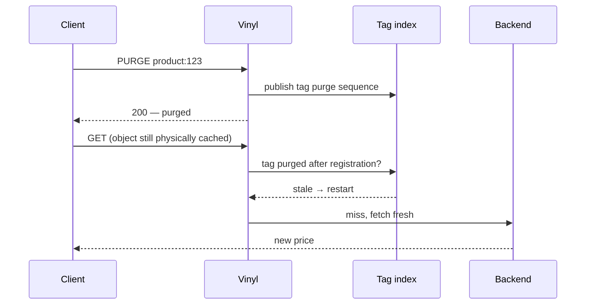

# Cachetag VMOD for Vinyl Cache

The VMOD implements purge-map based tag invalidation with explicit VCL tag registration, hard and soft purge, volatile membership cleanup, persistent Fellow FDO attributes, VSC counters, and a VTC regression suite.

**Status:** Heavily tested, but no large real-world deployments.

**Help me optimize cachetag for your use-case. [I'm collecting real-world `xkey` workloads](https://github.com/boffinate/xkey-workload-collector)**.

## Why did I build this?

I've been wanting to try improving on `xkey` for 5+ years and the rise of (mostly) competent LLMs has allowed me to find the time to try out some ideas. 

I have been fascinated by caching for over 2 decades. With the kind of applications I work on, caching by URL never works, because there are dependencies between pages. Being able to label cached content with tags, and then clear all matching resources has always seemed a powerful and sensible approach - yet is rarely found built into HTTP caching systems. Your choice is limited:

* Varnish Cache? Yes - but `xkey` is archived and the commercial `ykey` is the recommended approach. 
* Nginx? Nope. You have to build it yourself at the application level. I have and I don't recommend this approach. 
* Apache Traffic Server? Use Redis and custom Lua. 
* Caddy? Use Souin, which has HTTP RFC correctness, but struggles with performance.
* Or hand-off the responsibility to a 3rd party CDN like Fastly or Cloudflare, and be at their mercy for cache eviction.

After the [Varnish Cache/Vinyl Cache ~~debacle~~ split](https://vinyl-cache.org/organization/on_vinyl_cache_and_varnish_cache.html) I decided that I was going to have a go at building something to rival the commercial `ykey` for performance. 

I was also working on a project that needed on-disk persistant cache (due to the number of pages on the site and long-tail nature of traffic), so I needed a cache tagging system to work with Uplex's [Fellow Storage Engine](https://code.uplex.de/uplex-varnish/slash) (an alternative to the commercial Varnish MSE4 on-disk storage engine). Nils shared some  [initial comments](https://gitlab.com/uplex/varnish/slash/-/work_items/141) that steered my thinking on the approach I wanted to take.

## Cachetag performance vs `xkey`

At 10 million objects with four low-fanout tags each, **`cachetag` uses 82% less tracked index memory than `xkey` while achieving a 14.8% higher load rate**. Its warm-hit rate remains within 2% of `xkey`.

| 10M-object result | `cachetag` | `xkey` | Difference |
| --- | ---: | ---: | ---: |
| Tracked index memory | 833 MiB (87 bytes/object) | 4.55 GiB (489 bytes/object) | **82% less** |
| Observed load rate | 80.2k RPS | 69.8k RPS | **14.8% higher** |
| Observed warm-hit rate | 188.0k RPS | 191.8k RPS | Within 2% |

The tracked counters cover each implementation's index, not total process memory. This comparison uses in-memory `xkey`; its eager object-expiry lifecycle differs from cachetag's purge-history checks.

### `cachetag` performance on supported storage backends

Cachetag supports Vinyl Cache's Default in-memory storage, Buddy in-memory, and Fellow persistent storage:

| Storage backend | Observed load rate | Observed warm-hit rate | Membership result |
| --- | ---: | ---: | --- |
| Default (32 GiB) | 80.2k RPS | 188.0k RPS | 833 MiB tracked resident index (87 bytes/object) |
| Buddy (32 GiB) | 78.3k RPS | 189.9k RPS | 833 MiB tracked resident index (87 bytes/object) |
| Fellow (128 GiB, 4 KiB blocks) | 19.8k RPS | 82.5k RPS | 80 persistent attribute bytes/object (763 MiB total); zero resident cachetag objects and edges |

Rates are three-run medians from exact Vinyltest lab runs on one AMD EPYC 4345P host with 16 logical CPUs, using 24 clients and 24 Vinyl worker threads with no swap or LRU eviction. The 24-client setting was the best cache-fill point in a bounded calibration, but the in-memory rows remained classified under-saturated: these are achieved rates, not server capacity. Fellow was IO-limited; its on-disk row and the in-memory rows use different validated storage envelopes and are not a storage-capacity comparison.

Exact values, spreads, validity, provenance, and the approved publication exception are recorded in the maintainer's benchmark archive; see the [full benchmark results](benchmarks/RESULTS.md) for the wider benchmark history.

## Installation

See [INSTALL.md](INSTALL.md).

## Usage

See [USAGE.md](USAGE.md).


## How strict is the invalidation guarantee?

"Strict" means: when a purge returns success, can a user still be served old content? The answer for most tag caches is yes, for a while.

`xkey` purges what it can reach *right now*: it walks the matching objects and expires the ones that aren't busy. Anything busy, mid-fetch, or stuck behind a huge fanout can slip through and keep serving until the next purge, a TTL expiry, or a refresh catches it. Usually that's harmless. Sometimes it keeps a wrong price or a headline visible on your site.

`cachetag` takes the other route: instead of chasing down every copy, it changes what counts as current. A purge records history for a tag and every cached object remembers the purge sequence it registered under. Before serving a hit, `cachetag` probes that history and refuses content invalidated since registration. Physical deletion is not what decides freshness.



Freshness does not depend on physical deletion. A copy that was busy, mid-fetch, or restored after restart is checked against purge history before delivery.

Internally, tag identity is a 128-bit XXH3 digest of namespace plus tag text. A digest collision would make two different tags share purge history, so purging one would over-invalidate the other. That is an intentional fail-closed tradeoff: a collision can cause a needless refetch, but it does not create a path for serving content older than a successful purge.

### Where it matters

Take a flash sale. You're under heavy load. You drop the price on `product:123`, which appears on the product page, category listings, search, recommendations, cart suggestions, and a handful of cached API fragments. With `xkey`, a busy or mid-fetch copy can survive the purge until something else catches it. With `cachetag`, every later hit registered before the successful purge is restarted.

The stakes are higher again on a disk-backed cache that survives restarts, where a missed copy can quietly resurface after a reboot. `cachetag` keeps the purge history on disk too, so a resurrected object is still checked against it and still treated as stale. A hard-purged cold Fellow vampire may remain physically present until its first touch, TTL expiry, or Fellow LRU eviction because there is deliberately no tag-to-object posting index for cold objects. Physical residency is not freshness: the first touch probes the object's FDO attribute and rejects it before delivery. Missing or invalid attributes and Fellow metadata read failures fail closed by treating the object as hard stale; a valid envelope without the queried namespace remains fresh.

## Differences from `xkey` and `ykey`

I've tried to do a fair comparison because they all make different choices and tradeoffs and *this is interesting* to a nerd like me. If you spot an error or omission, please open a PR.

| Area | `xkey` | `ykey` | `cachetag` |
| --- | --- | --- | --- |
| Status | Public `varnish-modules` VMOD. Its own documentation says it is in maintenance mode with known scalability issues. | Commercial Varnish Enterprise 6.X VMOD, publicly presented as the successor to `xkey` for scalable secondary-key invalidation. | Experimental research VMOD for Vinyl Cache 9.X. |
| Tag registration | Automatic object-event scan of response headers named `xkey` and legacy `X-HashTwo`. | Explicit VCL calls: `ykey.add_key()` or `ykey.add_header(beresp.http.Some-Header)` in `vcl_backend_response` or `vcl_backend_error`. | Explicit VCL calls: `tags.add("key")` or `tags.add_header(beresp.http.Some-Header)` in `vcl_backend_response` or `vcl_backend_error`. |
| Parsing | Splits `xkey`/purge strings on commas or blanks. Multiple `xkey` response headers are also scanned. | Configurable separators for `add_header()`, `add_keys()`, `purge_header()`, and `purge_keys()`, defaulting to comma/space-style splitting. It also exposes hashed-key and blob helpers. | Configurable separators for `add_header()` and `purge_header()`, defaulting to comma separation. Tokens are trimmed, embedded whitespace is rejected, and configured size/key-count limits are enforced. |
| API shape | Module-level functions: `xkey.purge(keys)` and `xkey.softpurge(keys)` over a global index. | Module-level VMOD API with add, purge, stat, tree-key, expression-purge, and namespace helpers. Varnish Enterprise can treat `ykey` as a product feature spanning the VMOD, Varnish core, and MSE storage engines under a shared release boundary. | Object-oriented namespace: `new tags = cachetag.namespace(...)`, then `tags.purge(...)`, `tags.purge_header(...)`, `tags.stale()`, and counters per namespace/VCL object. Unlike `ykey`, `cachetag` has to coordinate behavior across a standalone VMOD, Vinyl Cache, and the Fellow storage engine. |
| Invalidation guarantee (strictness) | Best-effort. A purge removes the matching copies it can reach at that moment; busy and in-flight copies can keep serving until a TTL, refresh, or later purge catches them. | Core-integrated. Because tags are committed through Varnish core and the storage engine, a purge can act on an object as soon as it is indexed — a stronger model than `xkey`'s best-effort reach. Its exact behavior in narrow fetch/commit race windows is not something I can speak to from public documentation. | Strict read barrier. A successful purge publishes history immediately and every later hit registered before that publication reads as stale, including busy, racing, and replayed-after-restart copies. |
| Hard purge model | Iterates the current matching object list and re-arms matched non-busy objects to expire. Busy objects are skipped. | Hard purge immediately removes matched objects through core/storage integration. | Hard purge publishes history; insertion and `stale()` probes reject objects invalidated after registration. |
| Soft purge model | `xkey.softpurge(keys)` expires matched objects while preserving grace and keep. | Soft purge expires matched objects while preserving grace and keep; configured with `soft=true`. | Soft purge expires matched objects while preserving grace and keep; configured with `mode = soft`. |
| High-fanout purges | Purge work is inline in the caller. | Designed to safely handle purge operations on keys spanning the entire cache. There is no public asynchronous backpressure API; purge functions return affected counts. | Publication cost is independent of tagged-object fanout; accepted calls return `-1` and physical residency never determines freshness. |
| Concurrency design | Uses a single global mutex around inserts, removals, and purges in the open-source implementation. | Integrated into core Varnish, with its own data structures. Avoids `xkey`'s expiry-lock piggybacking. | Uses a purge map plus synchronized volatile membership records; Fellow-direct objects require no VMOD membership record. |
| Namespaces | One global VMOD index. | Supports namespaces as per-transaction state, set with `ykey.namespace()` and cleared with `ykey.namespace_reset()`. | Supports namespaces as explicit VCL objects: multiple `cachetag.namespace()` objects can coexist, each with its own limits, counters, and optional persistence path. |
| Persistence | In-memory VMOD index; no xkey-specific persistent sidecar. | Works with in-memory cache storage; for MSE/MSE4 persisted caches, stores the secondary-key index in storage metadata so restarts do not re-evaluate every object. | Works memory-only by default; optional Fellow-backed `persist_path` stores purge history in the cachetag WAL and immutable object membership in a checksummed FDO attribute. Fellow objects are probed directly without reconstructing a VMOD object index after restart. |
| Observability | Exposes aggregate key and memory counters such as `g_keys`, `g_bytes`, and component byte gauges. | Includes per-key stat functions for counts, TTL/grace/keep, body length, hits, flags, and headers; MSE docs/release notes mention ykey counters for registered keys, purged objects, memory, and invalidation time. | Exposes volatile membership gauges, purge-map sequence/probe/pruning counters, stale validation, WAL health, and Fellow attribute/direct-probe failure counters. |
| Migration shape | Existing deployments typically rely on the magic `xkey` response header and `xkey.purge(req.http.xkey)` in a protected `PURGE` path. | Use the same backend header if you want, but call `ykey.add_header(beresp.http.xkey, sep = " ")` and map purge requests to `ykey.purge_header(...)`. | Use the same backend header if you want, but call `tags.add_header(beresp.http.xkey, sep = " ")` and map purge requests to `tags.purge_header(...)`. |

## Testing In Docker

The development tooling in this section (`scripts/`, `benchmarks/`, `docker/`) ships in the git repository only, not in release tarballs — clone the repository if you want it.

Most contributors and agents should use the Docker wrapper for verification, not a host-local build. The wrapper builds Vinyl, installs it into a temporary prefix, builds this VMOD as a standalone package, and runs the requested checks. It does not modify the Vinyl source checkout.

Full distribution check:

```sh
scripts/test-with-vinyl-cache.sh ../vinyl-cache
```

Fast test suite:

```sh
CACHE_TAG_CHECK_TARGET=check scripts/test-with-vinyl-cache.sh ../vinyl-cache
```

Smoke check that the VMOD builds and loads into Vinyl:

```sh
CACHE_TAG_CHECK_TARGET=check CACHE_TAG_TESTS=vtc/cachetag_c00000.vtc \
  scripts/test-with-vinyl-cache.sh ../vinyl-cache
```

Run one regression:

```sh
CACHE_TAG_CHECK_TARGET=check CACHE_TAG_TESTS=vtc/cachetag_r00004.vtc \
  scripts/test-with-vinyl-cache.sh ../vinyl-cache
```

Full Fellow integration check, including patched Slash/Fellow and the persistent cachetag VTCs:

```sh
scripts/test-fellow-with-vinyl-cache.sh ../vinyl-cache
```

Set `SLASH_SRC=/path/to/slash` when the Slash checkout is not next to this repository.

The current implementation depends on Vinyl internal cache APIs and headers:

- `cache/cache.h`
- object event subscription and `OEV_INSERT`/`OEV_EXPIRE`
- `HSH_Kill`
- `EXP_Reduce`
- `struct objcore` timer and flag fields

These are the same kind of private cache surfaces used by VMODs such as ``xkey``. The practical consequence is version coupling: this repository can be distributed separately, but it must be built and tested against a compatible Vinyl Cache development tree or package exposing those internal headers and symbols.

After configuring this project, the Docker check is also available as a make target:

```sh
make check-with-vinyl-cache VINYL_CACHE_SRC=/path/to/vinyl-cache
```

## AI disclosure

Most of this project is AI generated. I provided all the requirements, and had a strong sense of what I wanted produced. 75% of the initial planning was done using Anthropic Fable 5 (it was good), and recent planning by GPT-5.5 (x)High and GPT-5.6 Sol xhigh. Coding was done by GPT-5.5 High and code review by both Codex and Claude. Testing is a mix of me and GPT.

## License

MPL-2.0. See [`LICENSE`](LICENSE). Portions derived from Varnish Cache and Vinyl Cache, and the bundled xxHash header, remain under BSD-2-Clause; their notices are retained in `LICENSE` and `src/xxhash.h`.
