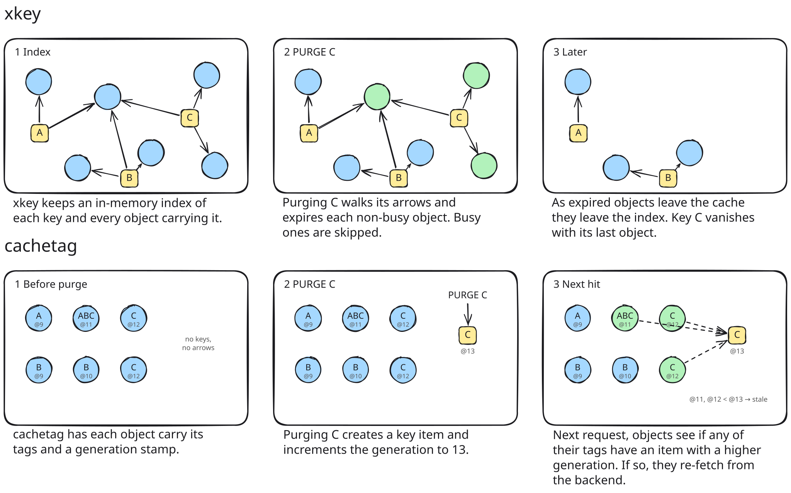

# Cachetag: tag-based invalidation VMOD for Vinyl Cache

Cachetag is a new approach to tag-based cache invalidation, which is more memory efficient and gives [stricter freshness guarantees](docs/strictness.md) than `xkey`. It requires [Vinyl Cache](https://vinyl-cache.org/) 9.x (Varnish Cache support is planned) and supports multiple storage engines.

> [!TIP]
> Help me make Cachetag faster for your workloads! [Read more](#optimize-cachetag)

## How cachetag differs from xkey



This generational approach saves memory, particularly for large caches. It also allows us to work efficiently with Fellow on-disk storage.

## Requirements

- Vinyl Cache 9.x or trunk
- A supported storage engine:
  - Vinyl's bundled in-memory storage
  - Buddy
  - Fellow (patches required)

## Installation

See [our installation guide](docs/install.md).

## Quickstart VCL

Check out our [usage guide](docs/usage.md) for more details, but this gives you an idea of what's involved:

```vcl
import cachetag;

sub vcl_init {
    new tags = cachetag.namespace("default");
}

sub vcl_backend_response {
    // Backend sends: Cache-Tag: article:123, author:42, section:news
    if (beresp.http.Cache-Tag) {
        tags.add_header(beresp.http.Cache-Tag);
        unset beresp.http.Cache-Tag;
    }
}

sub vcl_recv {
    // Put this behind an ACL before you deploy to production
    if (req.method == "PURGE" && req.http.Cache-Tag-Purge) {
        set req.http.purged = tags.purge_header(req.http.Cache-Tag-Purge);
        if (req.http.purged == "-1") {
            return (synth(200, "Purge accepted"));
        }
        return (synth(503, "Purge failed (" + req.http.purged + ")"));
    }
}

sub vcl_hit {
    if (tags.stale()) { return (restart); }
}

sub vcl_deliver {
    if (tags.stale()) { return (restart); }
}
```

The `stale()` check runs twice on purpose: `vcl_hit` rejects cache hits that a purge has invalidated, and `vcl_deliver` closes the race where a purge happens while the fetch or delivery is in progress.

[The usage guide](docs/usage.md) covers separators, registration limits, soft purges, return codes, and Fellow persistence.

## Why did I build this?

I've been wanting to try improving on `xkey` for 5+ years, and the rise of (mostly) competent LLMs has allowed me to find the time to try out some ideas (details in the [AI disclosure](#ai-disclosure)).

With the kind of applications I work on, clearing cache by URL never works, because pages have dependencies. Being able to label cached content with tags, and then clear all matching resources, has always seemed a powerful and sensible approach — yet is rarely found built into HTTP caching systems.

Your choice is limited:

* Varnish Cache? Yes, `xkey` works and is actively maintained, but the commercial `ykey` is recommended for high-traffic applications.
* Nginx? Nope. You have to build it yourself at the application level. I have and I don't recommend this approach.
* Apache Traffic Server? Build it yourself with Redis and custom Lua scripts.
* Caddy? Use Souin, which has HTTP RFC correctness, but struggles with performance.
* Or hand off the responsibility to a 3rd-party CDN like Fastly or Cloudflare, and be at their mercy for cache eviction.

I also needed a persistent on-disk cache for a project, which meant cache tagging had to work with Uplex's [Fellow Storage Engine](https://code.uplex.de/uplex-varnish/slash) (an alternative to the commercial Varnish MSE4 storage engine). Nils shared some [initial comments](https://gitlab.com/uplex/varnish/slash/-/work_items/141) that helped shape the approach.
<a name="optimize-cachetag"></a>
## Help me optimize cachetag for your workloads

There are design decisions I can't settle without data from more real-world deployments, because the site I use cachetag for *may be very different from most*.

For example: string interning. If many objects share the same tag set (as my site does), interning those sets cuts memory usage. If most workloads carry unique tag sets, interning *raise*s memory. Is it a good change to Cachetag? Benchmarks can't answer this, only real traffic data can.

There are two ways you can help me optimize Cachetag for your use-cases:

- **Already running `xkey`?** Please share your request rate, tag distribution, repeated tag sets, purge patterns & more. I created [`xkey-workload-collector`](https://github.com/boffinate/xkey-workload-collector) to gather these numbers automatically for you.
- **Running at scale?** Have high request rates, millions of cached objects, frequent or high-fanout purges? I'd love to help you deploy and tune cachetag, investigate anything you uncover, and learn from your workload. Your experience will shape where the project goes next. When [getting in touch](mailto:peter@boffinate.com), please share your peak request rate, cache size or object count, purge frequency, and storage backend.

## Testing

Development of cachetag is backed by [tests](docs/testing.md), profiling and [benchmarks](benchmarks/README.md).

## AI disclosure

Most of this project's code is AI generated. I provided all the requirements and had a strong sense of what I wanted produced. About 75% of the initial planning was done with Anthropic Fable 5, which was good, and recent planning with GPT-5.5 (x)High and GPT-5.6 Sol xhigh. Coding was GPT-5.5 High, with code review by Codex and Claude. Testing is a mix of me and GPT.

I know some feel AI written software is substandard. All I can say is cachetag is well tested, it's benchmarked to death, and you're welcome to reproduce the results.

## License

MPL-2.0. See [`LICENSE`](LICENSE). Portions derived from Varnish Cache and Vinyl Cache, and the bundled xxHash header, remain under BSD-2-Clause; their notices are retained in `LICENSE` and `src/xxhash.h`.
