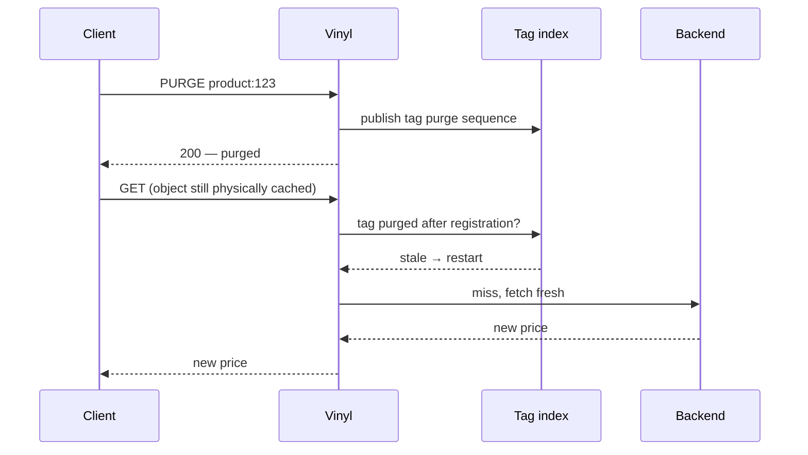

# Cachetag VMOD: tag-based invalidation for Vinyl Cache

Cachetag adds tag-based invalidation to Vinyl Cache, supporting its in-memory backends and Fellow persistent storage. At scale it's designed to be significantly more memory efficient than the bundled `xkey`.

## What is cache tagging?

Cache tags group related pages and fragments so you can invalidate them in one operation. A product page, category listing, and API response might all carry `product:123`. When the product changes, one purge invalidates all three without tracking down each URL.

## Why did I build this?

I've been wanting to try improving on `xkey` for 5+ years and the rise of (mostly) competent LLMs has allowed me to find the time to try out some ideas.

With the kind of applications I work on, clearing cache by URL never works, because pages have dependencies. Being able to label cached content with tags, and then clear all matching resources has always seemed a powerful and sensible approach - yet is rarely found built into HTTP caching systems.

Your choice is limited:

* Varnish Cache? Yes - but `xkey` is archived and the commercial `ykey` is the recommended approach.
* Nginx? Nope. You have to build it yourself at the application level. I have and I don't recommend this approach.
* Apache Traffic Server? Build it yourself with Redis and custom Lua scripts.
* Caddy? Use Souin, which has HTTP RFC correctness, but struggles with performance.
* Or hand-off the responsibility to a 3rd party CDN like Fastly or Cloudflare, and be at their mercy for cache eviction.

I also needed a persistent on-disk cache for a project, which meant cache tagging had to work with Uplex's [Fellow Storage Engine](https://code.uplex.de/uplex-varnish/slash) (an alternative to the commercial Varnish MSE4 storage engine). Nils shared some  [initial comments](https://gitlab.com/uplex/varnish/slash/-/work_items/141) that helped shape the approach.

## Cachetag benchmark performance vs `xkey`

At 10 million objects with four low-fanout tags each, **`cachetag` used 82% less tracked index memory than `xkey` and loaded 14.8% faster**. Its warm-hit rate stayed within 2% of `xkey`.

| 10M-object result | `cachetag` | `xkey` | Difference |
| --- | ---: | ---: | ---: |
| Tracked index memory | 833 MiB (87 bytes/object) | 4.55 GiB (489 bytes/object) | **82% less** |
| Observed load rate | 80.2k RPS | 69.8k RPS | **14.8% higher** |
| Observed warm-hit rate | 188.0k RPS | 191.8k RPS | Within 2% |

The tracked counters cover each implementation's index, not total process memory. This comparison uses in-memory `xkey`; its eager object-expiry lifecycle differs from cachetag's purge-history checks.

### `cachetag` performance on supported storage backends

Cachetag supports Vinyl Cache's Default in-memory storage, Buddy in-memory, and Fellow persistent storage:

| Storage backend | Observed load rate | Observed warm-hit rate | Membership result |
| --- | ---: | ---: | --- |
| Default (32 GiB) | 80.2k RPS | 188.0k RPS | 833 MiB tracked resident index (87 bytes/object) |
| Buddy (32 GiB) | 78.3k RPS | 189.9k RPS | 833 MiB tracked resident index (87 bytes/object) |
| Fellow (128 GiB, 4 KiB blocks) | 19.8k RPS | 82.5k RPS | 80 persistent attribute bytes/object (763 MiB total); zero resident cachetag objects and edges |

Results are three-run medians from controlled tests on one host. The in-memory rates show achieved throughput, not maximum server capacity. Fellow was I/O-limited and used a different storage configuration, so the rows do not compare storage capacity. See the [full benchmark results](benchmarks/RESULTS.md) for the methodology, run data, and limitations.

## Running Cachetag at scale?

I’m looking for production workloads with high request rates, millions of cached objects, or frequent or high-fanout purges.

If that sounds like your deployment, I’d love to help you deploy and tune it, investigate any issues you uncover, and learn from your workload. Your experience will help shape the open-source project.

When getting in touch, please include your peak request rate, cache size or object count, purge frequency, and storage backend. [`xkey-workload-collector`](https://github.com/boffinate/xkey-workload-collector) gathers those numbers for you, on Vinyl Cache or Varnish Cache.

## Installation

See [INSTALL.md](INSTALL.md).

## Usage

See [USAGE.md](USAGE.md).

## How strict is the invalidation guarantee?

"Strict" means: when a purge returns success, can a user still be served old content? The answer for most tag caches is yes, for a while.

`xkey` purges what it can reach *right now*: it walks the matching objects and expires the ones that aren't busy. Anything busy, mid-fetch, or stuck behind a huge fanout can slip through and keep serving until the next purge, a TTL expiry, or a refresh catches it. Usually that's harmless. Sometimes it keeps a wrong price or a headline visible on your site.

`cachetag` takes the other route: instead of chasing down every copy, it changes what counts as current. A purge records history for a tag and every cached object remembers the purge sequence it registered under. Before serving a hit, `cachetag` probes that history and refuses content invalidated since registration. Physical deletion is not what decides freshness.



A copy that was busy, mid-fetch, or restored after restart is checked against purge history before delivery.

Internally, tag identity is a 128-bit XXH3 digest of namespace plus tag text. A digest collision would make two different tags share purge history, so purging one would over-invalidate the other. That is an intentional fail-closed tradeoff: a collision can cause a needless refetch, but it does not create a path for serving content older than a successful purge.

### Where it matters

During a flash sale, a price may appear on product pages, listings, search results, recommendations, and API responses. With xkey, a busy or mid-fetch copy can survive a purge. Cachetag rejects every copy invalidated by a successful purge before it can be served.

With Fellow, purge history also survives restarts. Invalidated content may remain physically on disk, but Cachetag rejects it when next accessed rather than allowing it to resurface after a reboot.

## Differences from `xkey` and `ykey`

I've tried to do a fair comparison because they all make different choices and tradeoffs and *this is interesting* to a nerd like me. If you spot an error or omission, please open a PR.

| Area | `xkey` | `ykey` | `cachetag` |
| --- | --- | --- | --- |
| Status | Open-source `varnish-modules` VMOD in maintenance mode, with known scalability issues. | Commercial Varnish Enterprise 6.x successor to `xkey`. | Open-source VMOD for Vinyl Cache 9.x; Varnish Cache support planned. |
| Tag registration | Automatically scans `xkey` and legacy `X-HashTwo` response headers. | Explicit VCL calls with `add_key()` or `add_header()`. | Explicit VCL calls with `tags.add()` or `tags.add_header()`. |
| Parsing | Splits on commas or whitespace and scans repeated `xkey` headers. | Configurable separators; also supports hashed keys and blobs. | Configurable separators; trims tokens, rejects embedded whitespace, and enforces limits. |
| API shape | Module-level purge functions over one global index. | Module-level API for adding, purging, querying, expressions, tree keys, and namespaces. | Namespace objects expose registration, purging, stale checks, and per-namespace counters. |
| Invalidation guarantee (strictness) | Best-effort: busy or in-flight copies may survive until a later purge, refresh, or expiry. | Core-integrated and stronger than `xkey`; narrow fetch/commit races are not publicly documented. | Strict read barrier: copies invalidated by a successful purge cannot be served, including after restart. |
| Hard purge model | Expires reachable, non-busy matches; skips busy objects. | Hard purge immediately removes matched objects through core/storage integration. | Publishes purge history; insertion and stale checks reject invalidated objects. |
| Soft purge model | Preserves grace and keep via `softpurge()`. | Preserves grace and keep with `soft=true`. | Preserves grace and keep with `mode=soft`. |
| High-fanout purges | Purge work is inline in the caller. | Designed for cache-wide keys; returns affected counts. | Purge publication cost does not grow with fanout; accepted calls return `-1`. |
| Concurrency design | Single global mutex for inserts, removals, and purges. | Core-integrated; does not reuse `xkey`'s expiry lock. | Purge map with synchronized volatile membership; Fellow-direct objects need no VMOD membership. |
| Namespaces | One global VMOD index. | Per-transaction namespaces via `namespace()` and `namespace_reset()`. | Multiple namespace objects, each with its own limits, counters, and optional persistence. |
| Persistence | In-memory index only. | Persists the secondary-key index in MSE/MSE4 storage metadata. | Memory-only by default; Fellow persists purge history and object tags. |
| Observability | Aggregate key and memory counters. | Per-key stats plus aggregate registration, purge, memory, and timing counters. | Membership, purge-map, stale-check, WAL, and Fellow health counters. |
| Migration shape | Usually driven by an `xkey` response header and protected `PURGE` endpoint. | `add_header()` and `purge_header()` can reuse an existing `xkey` header. | `tags.add_header()` and `tags.purge_header()` can reuse an existing `xkey` header. |

## Testing in Docker

The development tooling in this section (`scripts/`, `benchmarks/`, `docker/`) ships in the git repository only, not in release tarballs — clone the repository if you want it.

Most contributors and agents should use the Docker wrapper for verification, not a host-local build. The wrapper builds Vinyl, installs it into a temporary prefix, builds this VMOD as a standalone package, and runs the requested checks. It does not modify the Vinyl source checkout.

Full distribution check:

```sh
scripts/test-with-vinyl-cache.sh ../vinyl-cache
```

Fast test suite:

```sh
CACHE_TAG_CHECK_TARGET=check scripts/test-with-vinyl-cache.sh ../vinyl-cache
```

Smoke check that the VMOD builds and loads into Vinyl:

```sh
CACHE_TAG_CHECK_TARGET=check CACHE_TAG_TESTS=vtc/cachetag_c00000.vtc \
  scripts/test-with-vinyl-cache.sh ../vinyl-cache
```

Run one regression:

```sh
CACHE_TAG_CHECK_TARGET=check CACHE_TAG_TESTS=vtc/cachetag_r00004.vtc \
  scripts/test-with-vinyl-cache.sh ../vinyl-cache
```

Full Fellow integration check, including patched Slash/Fellow and the persistent cachetag VTCs:

```sh
scripts/test-fellow-with-vinyl-cache.sh ../vinyl-cache
```

Set `SLASH_SRC=/path/to/slash` when the Slash checkout is not next to this repository.

The current implementation depends on Vinyl internal cache APIs and headers:

- `cache/cache.h`
- object event subscription and `OEV_INSERT`/`OEV_EXPIRE`
- `HSH_Kill`
- `EXP_Reduce`
- `struct objcore` timer and flag fields

These are the same kind of private cache surfaces used by VMODs such as `xkey`. The consequence is version coupling: this repository can be distributed separately, but it must be built and tested against a compatible Vinyl Cache development tree or package exposing those internal headers and symbols.

After configuring this project, the Docker check is also available as a make target:

```sh
make check-with-vinyl-cache VINYL_CACHE_SRC=/path/to/vinyl-cache
```

## AI disclosure

Most of this project is AI generated. I provided all the requirements, and had a strong sense of what I wanted produced. 75% of the initial planning was done using Anthropic Fable 5 (it was good), and recent planning by GPT-5.5 (x)High and GPT-5.6 Sol xhigh. Coding was done by GPT-5.5 High and code review by both Codex and Claude. Testing is a mix of me and GPT.

## License

MPL-2.0. See [`LICENSE`](LICENSE). Portions derived from Varnish Cache and Vinyl Cache, and the bundled xxHash header, remain under BSD-2-Clause; their notices are retained in `LICENSE` and `src/xxhash.h`.
