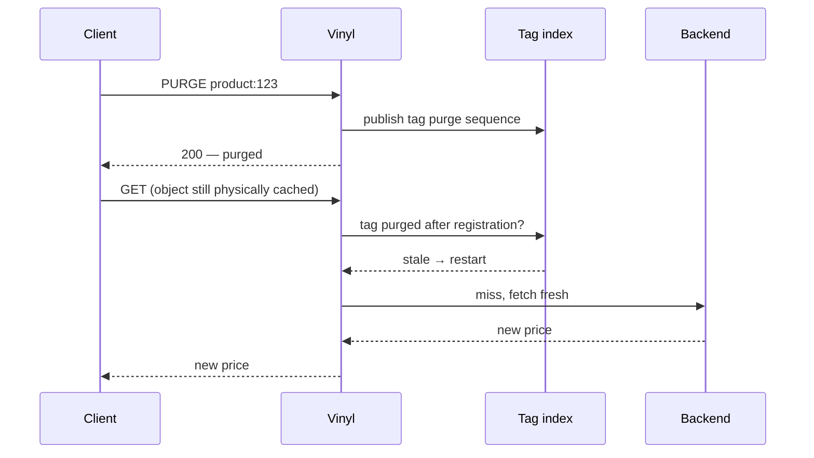

# How the strict invalidation guarantee works

"Strict" means: when a purge request returns success, can a user still be served old content? The answer for most tag caches is yes, for a while.

## What `xkey` does

`xkey` purges what it can reach at the moment you ask. It walks the objects matching a key and expires the ones that aren't busy. Anything busy, mid-fetch, or queued behind a large fanout slips through and keeps being served until a later purge, a refresh, or a TTL expiry catches it.

Most of the time that's harmless. Sometimes it leaves a wrong price or a withdrawn headline on your site.

## What cachetag does instead

Cachetag redefines what counts as current.

Every purge writes history for a tag, and every cached object remembers the purge sequence it registered under. Before a hit is served, cachetag reads that history and refuses anything invalidated since registration. Freshness is decided at read time, so a copy that physically survived the purge still cannot be delivered.

Underneath, a single purge map holds namespace-qualified digests of purged tags, and registration snapshots the current purge sequence. A purge that landed before registration leaves the object alone. A purge that lands after it gets caught twice: first by the insert probe, then by the `stale()` checks in `vcl_hit` and `vcl_deliver` that restart the request onto a fresh fetch.

## Where this matters

During a flash sale, one price can appear on product pages, listings, search results, recommendations, and API responses at once. Under `xkey`, whichever copies happen to be busy or mid-fetch when the purge lands will outlive it. Cachetag rejects every copy the purge invalidated, whatever state it was caught in.

Fellow carries purge history across a restart as well. Invalidated objects may still sit on disk after a reboot; cachetag rejects them when they're next read.

## How it can fail

Three ways, and every one of them errs toward invalidating too much.

**Digest collisions.** Tag identity is a 128-bit XXH3 digest of the namespace plus the tag text. Two colliding tags would share purge history, so purging one would invalidate the other as well. The trade is deliberate: a collision costs an unnecessary refetch and cannot produce content older than a successful purge.

**Partial durable purges.** When a namespace persists to disk, cachetag publishes each tag's purge in sequence, because a durable WAL record cannot be rolled back. Should a later tag in a multi-tag purge fail, the earlier tags stay durably purged and the call returns `-4`. The call over-invalidated and told you so; don't retry it blind.

**Persistence unavailable.** A persistent namespace that cannot write its WAL fails the purge outright, and never silently degrades to memory-only. You get `-4`, and no false claim of durability.

None of the three failure cases allow content older than a purge that returned success to be served.
